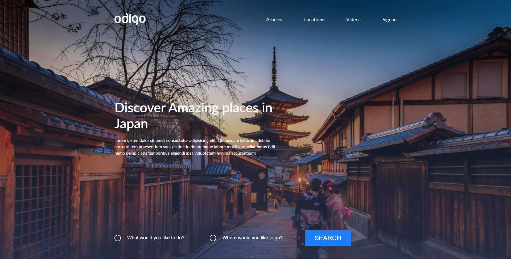

# Odigo

📄 **odigo** - это отзывчиво адаптивный лэндинг, как моя завершающая работа по верстке перед началом изучения **JavaScript**. Второй опыт использования **Figma** как инструмента для разбора макетов, от дизайнера: [𝒥𝒶𝒸ℴ𝒷 𝒱ℴ𝓎𝓁ℯ𝓈](https://dribbble.com/Jacobvoyles), [ссылка на макет](https://dribbble.com/shots/4969978-Travel-Landing-page-Freebie);

---

## about:

📑 Это мой финальный подытог всему что было _НАВЕРСТАНО_ (бадум тс-с-с) за пройденное время. На самом деле этот проект почти во всем повторяет мои уже ранее реализованные поделки~

- 📝 Краткий очерк по проделанной работе:
  - В процессе написания **HTML** кода использовалась методология **BEM**;
  - Для упрощённого написания стилей был выбран препроцессор **SASS/SCSS**;
  - Для позиционирования элементов страницы использовались _flex_ и _grid_.
  - Вся анимация и сложные конструкции были реализованы с помощью нативных возможностей **HTML5 & CSS3**;

---

## warning:

> 📌 _Работа над проектом прекращена:_
>
> > **odigo** _- это просто практика в верстке. Проект без использования **JavaScript**._
>
> **P.s.** _спасибо за ознакомление с работой_ 👋

---

<h1 align="center"><a href="https://lapard1n.github.io/odigo">odigo:</a></h1>

---
